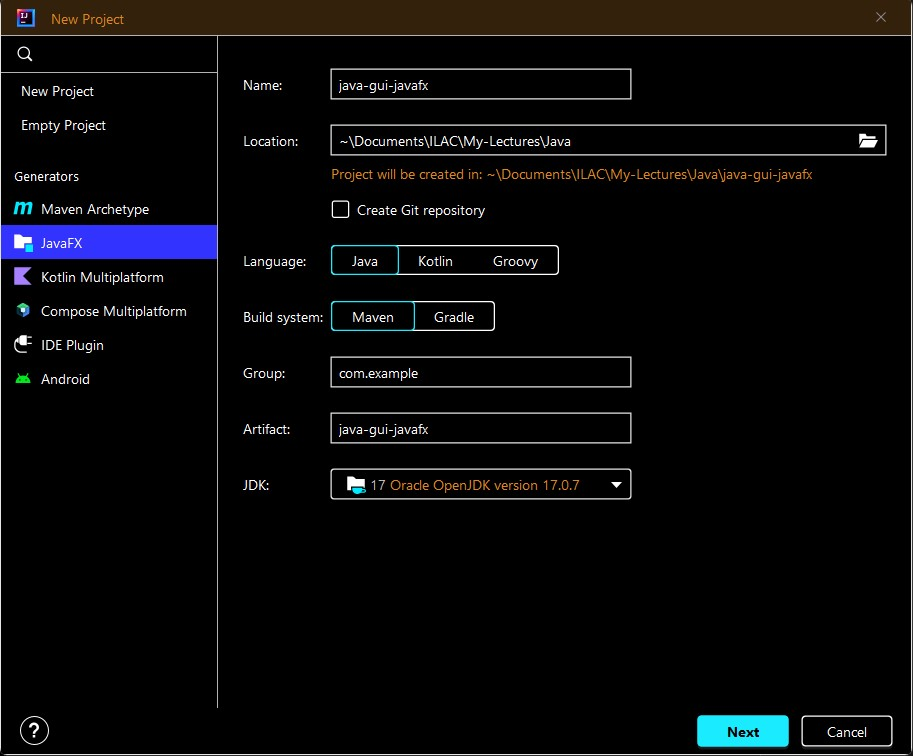
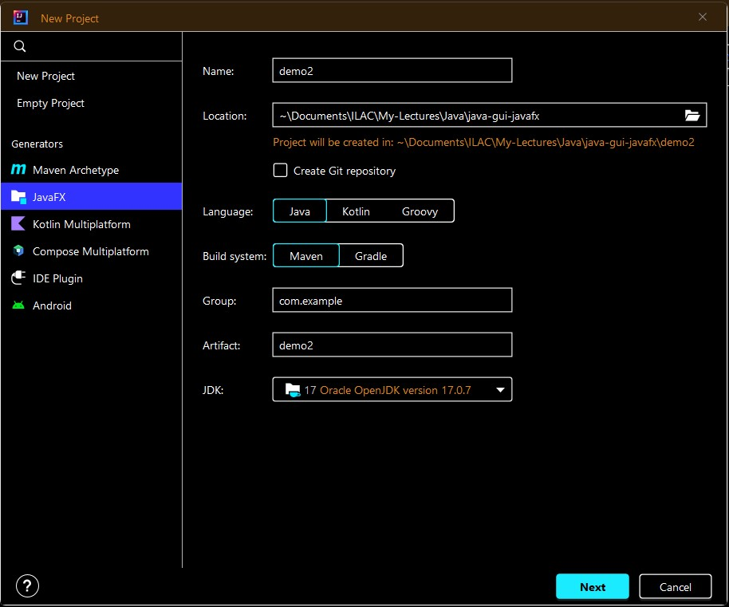
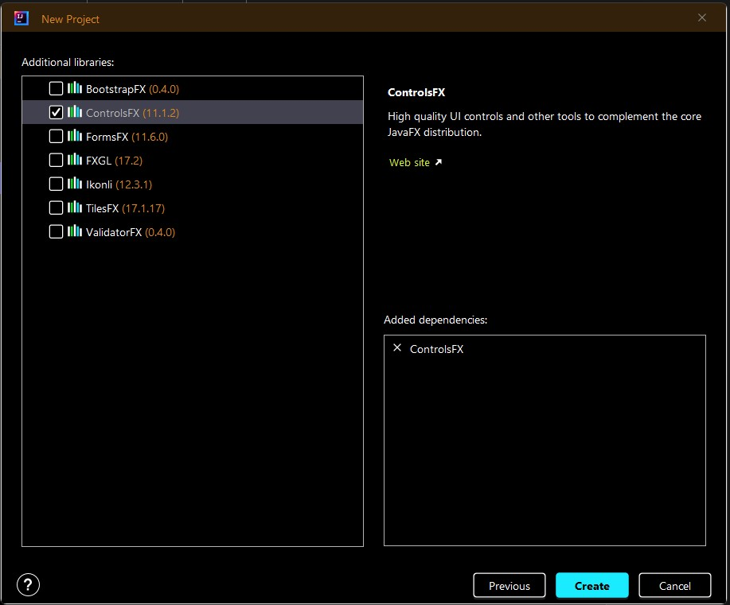
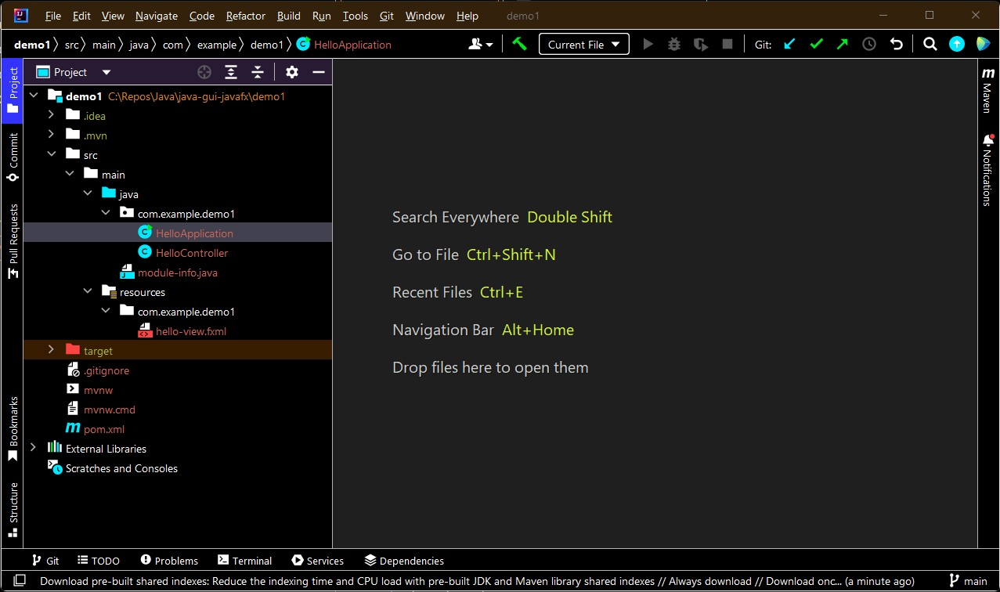
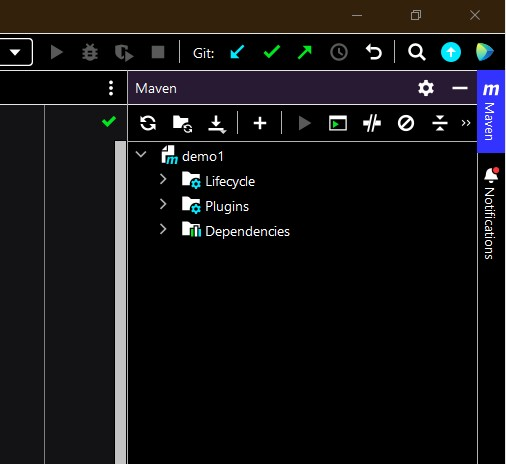
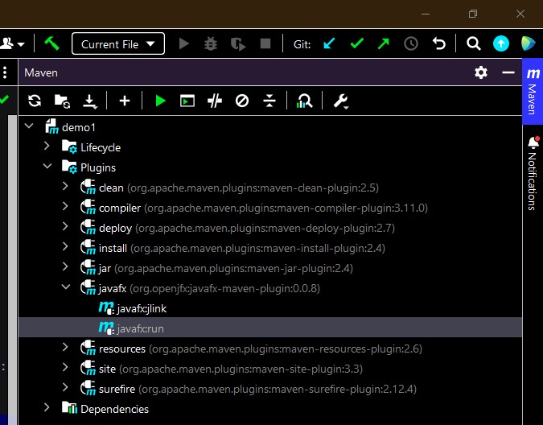
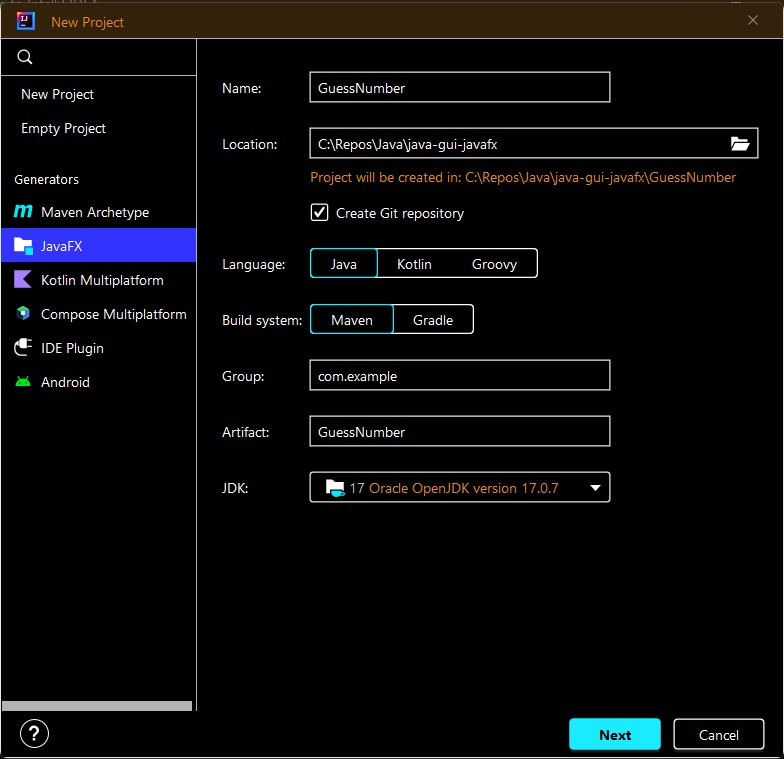
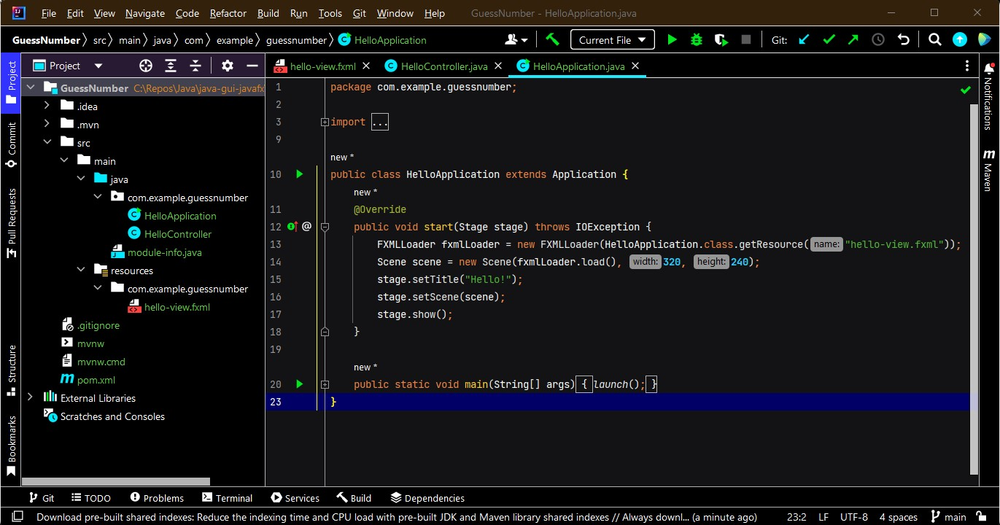

# java-gui-javaFX
A quick introduction to using the GUI framework "JavaFX". You need to start a new JavaFX with Maven Project then you can use the code in the main files to run your applications as I git ignored some folders and files:

- The main application to launch our project: **[HelloApplication.java]**
- The controller: **[HelloController.java]**
- The view: **[hello-view.fxml]**  

# About JavaFx
Java's original GUI (Graphical User Interface) framework ws the AWT, then followed by Swing. Your knowledge in using the Swing tools including basic GUI and event handling will be a great assets!

JavaFX uses MVC (Model View Controller) and supports CSS (Cascading Style Sheet) and FXML (Extensible Markup Language for JavaFX) for styling and building the user interface

JavaFx uses the MVC concept which is stands for Model-View-Controller and supports the use of CSS and FXML for styling and building the user interface. FXML apply the idea of "Separation of Concern" for separating the presentation from th logic.

JavaFX application can be easily integrated with Swing application

JavaFX has backwards compatibility with Swing.


# JavaFX Basic Concepts:


## JavaFx Packages
JavaFx framework is contained in packages that begins with "javafx" prefix. For example: javafx.application, javafx.stage, javafx.scene.

JavaFX provides a wide range of functionality and it's organized into modules like javafx.base, javafx.graphics, and javafx.controls

## The Stage and Scene Classes
Like with Swing, we have JFrame that contains JPanel. in JavaFx, we have  a "stage" that contains a "scene" or "Scene Graph".
- stage defines a space => Stage class => top level container 
- scene defines what goes in the stage space => Scene class => GUI items container

In other words, a stage is a container for scenes and a scene is a container for the items that comprise the scene.

All JavaFX applications have at least one stage (Primary Stage) and one scene. Scene contains controls like buttons, checkboxes. 

## Nodes and Scene Graphs
The JavaFX scene graph is the starting point for constructing a JavaFX application.  It is a hierarchical tree of nodes that represents all of the visual elements of the application's user interface. The individual element of a scene (Scene Graph) is called a "node". The collection of all nodes in a scene consists "Scene Graph" which comprises a "Tree". The base class for all nodes is "Node".

The root node is the base node that has no parent nodes, other nodes in the Scene Graph can have one parent and zero or more children nodes. Each individual node can have its own Event Handlers 

Each Node has:
- ID
- Style Class
- Bounding Volume

## CSS
JavaFX Cascading Style Sheets (CSS) provides the ability to apply customized styling to the user interface of a JavaFX application without changing any of that application's source code. JavaFX CSS is based on the W3C CSS version 2.1 specifications, with some additions from current work on version 3.

## UI Controls
The JavaFX UI controls available through the JavaFX API are built by using nodes in the scene graph.
***The image below is "JavaFX UI Controls Sample" from ["JavaFX: Getting Started with JavaFX"](https://docs.oracle.com/javase/8/javafx/get-started-tutorial/jfx-architecture.htm)***


## Layouts
JavaFX has several layout panes (as we practiced using Swing), examples:
- The **BorderPane** class lays out its content nodes in the top, bottom, right, left, or center region.
- The **HBox class** arranges its content nodes horizontally in a single row.
- The **VBox class** arranges its content nodes vertically in a single column (Good for menus or list of items).
- The **StackPane** class places its content nodes in a back-to-front single stack.
- The **GridPane** class enables the developer to create a flexible grid of rows and columns in which to lay out content nodes.
- The **FlowPane** class arranges its content nodes in either a horizontal or vertical ”flow,” wrapping at the specified width (for horizontal) or height (for vertical) boundaries.
- The **TilePane** class places its content nodes in uniformly sized layout cells or tiles
- The **AnchorPane** class enables developers to create anchor nodes to the top, bottom, left side, or center of the layout
- The **layouts are** packaged in javafx.scene.layout

To learn more about JavaFX Layout, check this ["JavaFX: Working with Layouts in JavaFX"](https://docs.oracle.com/javase/8/javafx/layout-tutorial/index.html)

## The Application Class and the Life-cycle Methods
A JavaFX application must be a subclass of the "Application" class, which is a packaged in javafx.application.
```
public class HelloApplication extends Application {
    // your code...
    // the main() method...
}
```

The class "Application" has defines three life-cycle methods that can be overridden by programmers:
- inti()
- start()
- stop()

#### - init() => The main entry point for all JavaFX applications.
```
public void init() throws Exception {
}
```

#### - start() => The start method is called after the init method has returned, and after the system is ready for the application to begin running. It's the entry point for all JavaFX application that must be overridden as it's defined as an abstract class
```
public abstract void start(Stage primaryStage) throws Exception;
```

- stop() => This method is called when the application should stop, and provides a convenient place to prepare for application exit and destroy resources.
```
public void stop() throws Exception {
}
```

## Launching a JavaFX Application:
the "launch()" method which is defined by "Application" class must be called inside the main() method (the entry point for any Java application). 
```
public static void main(String[] args) {
    launch();
}
```
## FXML (Interface Design):
javaFX uses a special FXML markup language which is an XML (Extensible Markup language) based structure to create the view interface. The .fxml file is used to create and design the GUI and this .fxml file is being loaded by the FXMLLoader class. You can learn more about this language by visiting ["Using FXML to Create a User Interface](https://docs.oracle.com/javase/8/javafx/get-started-tutorial/fxml_tutorial.htm)

## JAR File:
JAR file is a file format based on the popular ZIP file format and is used for aggregating many files into one. A JAR file is essentially a zip file that contains an optional META-INF directory. A JAR file can be created by the command-line jar tool, or by using the java.util.jar API in the Java platform. There is no restriction on the name of a JAR file, it can be any legal file name on a particular platform.

# JavaFX Application Skeleton:
All JavaFX applications share the same basic skeleton. When using IntelliJ with FXML, we will have 3 Java files:
- .fxml
- .java => The Controller file
- .java => The Application file

# JavaFx_Demo1 with Visual Studio Code Editor "javafx_demo1":
1- Creating a new Java project => CTRL + SHIFT + P
2- Select "JavaFX" from the dropdown list
3- Enter com.introduction (e.g. com.example)
4- Enter the project/application name like "demo" or "JavaFXDemo" to be the folder name for your project

# Creating JavaFx Application with IntelliJ IDEA IDE
Below are the main steps with the images:

- This image shows the general options for creating a JavaFx application:




- Here is an example of the setting for our project "demo2":




- You can see that we also add the controlsFX as the standard need for any GUI application:



# demo1 Application with IntelliJ IDEA IDE
Is just the initial starting point using "IntelliJ IDEA" IDE.
Below is a JavaFX application for a project named "demo1":


- The folder "src" then "main" folder:
    - java folder:
        - com\example\demo1:
            - **[HelloApplication.java]**
            - **[HelloController.java]**
        - The project system path for the two main .java files (the app & the controller): 
            - **demo1\src\main\java\com\example\demo1**
    - resources\com\example:
        - **[hello-view.fxml]**           

## Git Ignored
Notice that I have git ignored these auto-generated folders that we receive when choosing a JavaFX Maven project template:
.idea/
.mvn/
target/

## The coding files:
Reviewing the auto generated code of IntelliJ:
- HelloApplication.java => The entrypoint class file that creates the window
- HelloController.java => The controller that handles the events in view of the window controls
- hello-view.fxml.java => The xml file that contains the contents and layout information of the GUI

## Maven
Notice that the maven is activated with this project "mvnw"
JavaFX application can be run through the Maven command, so you can also follow these long steps to run your javaFX application!
Click the "Maven" tab on the right-side of the IDE, then:


  1- Expand your project
  2- Expand Plugins
  3- Expand javafx
  4- Double click javafx:run


  you can review this article: https://www.baeldung.com/javafx

## FXML Elements (inside .fxml document)
In FXML, an XML element represents one of the following:
- A class instance
- A property of a class instance
- A "static" property
- A "define" block
- A block of script code

As in Java, class names can be fully-qualified (including the package name), or they can be imported using the "import" processing instruction (PI). For example, the following PI imports the javafx.scene.control.Label class into the current FXML document’s namespace:
``` Java
<?import javafx.scene.control.Label?>
```

The prefix "fx:":
- <fx:include>
    - The <fx:include> tag creates an object from FXML markup defined in another file. It is used as follows:
    - > <fx:include source="filename"/>

- <fx:constant>
    - The <fx:constant> element creates a reference to a class constant
    - > <Double fx:constant="NEGATIVE_INFINITY"/>

- <fx:reference>
    - The <fx:reference> element creates a new reference to an existing element
    - It is used in conjunction with either the **fx:id** attribute or with a script variables. 
    - The "source" attribute of the <fx:reference> element specifies the name of the object to which the new element will refer.
        - > <fx:reference source="myImage"/>

- <fx:copy>
    - The <fx:copy> element creates a copy of an existing element
    
- <fx:root>
    - The <fx:root> element creates a reference to a previously defined root element

- <fx:include source="filename"/>
    - The <fx:root> element creates a reference to a previously defined root element.

# demo2 Application IntelliJ IDEA IDE:
Creating an application named "demo2":
- to receive a user input from text field
- to respond to an event with a button press
- to modify label or a text field

You can follow the same steps from "demo1"
- Starting with the "View" => hello-view.fxml
- Adding an event to the button => Using the "Controller" => HelloController.java

# GuessNumber Application with IntelliJ IDEA IDE
To guess the lucky number between 1 and 10

1. Start a new project


2. Also select the minimum need for this demonstration/example which is the "ControllerFX"


3. The initial workspace with the default code of the three files:
    - HelloApplication.java (Right-Click class name => Refactor => Rename => GuessNumberApp)
    - HelloController.java (Right-Click class name => Refactor => Rename =>GuessNumberController)
    - hello-view.fxml:
        - If you rename the .fxml file, you will need to modify the code also
        - IJ will prompt you to change the code if you rename this file
            - You can choose either "Do Refactor" or "Cancel"
    - The package name will be "com.example.guessnumber":
        ```java
        package com.example.guessnumber;
        ```


# JavaTerm Application with IntelliJ IDEA IDE
Has the essential code to work with Radio button with simple console output. The full complete application to be completed by the students.

# Credits, References, Tools and Recourses:
- [IntelliJ IDEA](https://www.jetbrains.com/idea/)
- [Java How to Program, 11/e By by Paul Deitel and Harvey Deitel](https://deitel.com/java-how-to-program-11-e-early-objects-version/)
- [Java by Herbert Schildt 7th addition (Oracle Press)](https://herbschildt.com/)
- [Java Platform, Standard Edition (Java SE) 8 - Client Technology](https://docs.oracle.com/javase/8/javase-clienttechnologies.htm)
- [JavaFX: Getting Started with JavaFX](https://docs.oracle.com/javase/8/javafx/get-started-tutorial/index.html)
- [Getting Started with JavaFX Sample Applications](https://docs.oracle.com/javase/8/javafx/get-started-tutorial/get_start_apps.htm#JFXST804)
- https://www.baeldung.com/javafx
- [Introduction to FXML](https://docs.oracle.com/javafx/2/api/javafx/fxml/doc-files/introduction_to_fxml.html#class_instance_elements)